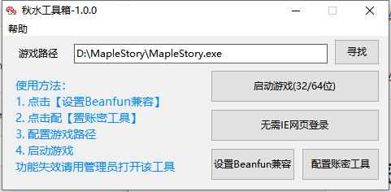

# QsTools 秋水工具箱

香港橘子Beanfun小工具，一体化网页登录解决方案。

支持TMS 32/64位台服新枫之谷运行，图个方便，易语言开发的。

## 介绍

该工具参考如下：

- [pungin](https://github.com/pungin)大神的[Beanfun登录器](TwMS-Helper
)

- [InWILL](https://github.com/InWILL)大神的**[Locale_Remulator](https://github.com/InWILL/Locale_Remulator)**

可以自己查看代码

自动使用管理员方式进入，如果失效麻烦右键管理员运行。

## 截图

## 下载

[QsTools秋水工具箱-Releases]([Releases · starmcc/QsTools (github.com)](https://github.com/starmcc/QsTools/releases))