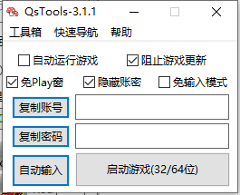
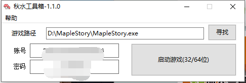

# QsTools 秋水工具箱

香港橘子Beanfun小工具，一体化网页登录解决方案。

支持TMS 32/64位台服新枫之谷运行，图个方便，易语言开发的，开源自取。

## 介绍

感谢下面的大神提供思路和开源代码

- [pungin](https://github.com/pungin)的[Beanfun登录器](TwMS-Helper
)
- [InWILL](https://github.com/InWILL)的[**Locale_RemulatorV1.4.1**](https://github.com/InWILL/Locale_Remulator)

## 截图

## 使用

1. 运行QsTools-Install.exe 
2. 按照说明进行使用

## 下载

[QsTools秋水工具箱-Releases](https://github.com/starmcc/QsTools/releases)