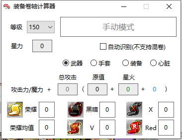

# QsTools 秋水工具箱

香港橘子`Beanfun`登录工具箱。

一体化网页登录最佳解决方案。

`1.1.2`版本以上支持`TMS` `32/64位`台服新枫之谷运行。

`1.1.1`版本以下包括`1.1.1`存在问题，请使用`1.1.2`版本以上。

## 介绍

本工具由易语言`5.9.2`版本编写，遵循`MIT`协议。

感谢下面的开源大神提供思路和代码

- [pungin/TwMS-Helper)](https://github.com/pungin/TwMS-Helper)
- [**InWILL/Locale_RemulatorV1.4.3**](https://github.com/InWILL/Locale_Remulator)

## 已实现

1. 一键设置IE各种兼容问题，如
   1. 让IE不再弹出"显示所有内容"。
   2. 兼容视图设置`beanfun.com`。
   3. 网页启动游戏路径自动设置。
2. 免输入模式，省去复制粘贴账号密码的烦恼。
3. 网页启动时自动启动游戏
4. 装备星力卷轴计算器（24星以上暂不准确）
5. 陆续添加....

## 工具图

## 使用

1. 运行`QsTools-Install.exe`
2. 按照提示做完三步，打开网页，启动游戏吧.

## 下载

[QsTools秋水工具箱-Releases](https://github.com/starmcc/QsTools/releases)