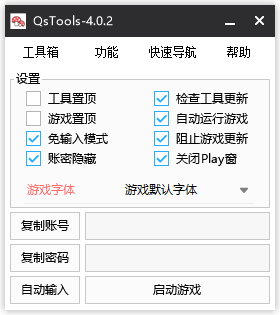

# QsTools 秋水工具箱

香港/台湾游戏橘子`Beanfun`登录工具箱`QsTools`。

一体化新枫之谷台服网页登录优秀解决方案。



## 介绍

本工具由易语言`5.9`版本编写，遵循`MIT`协议。

感谢下面的开源大神提供思路和代码

- [pungin/TwMS-Helper](https://github.com/pungin/TwMS-Helper)
- [**InWILL/Locale_RemulatorV1.4.3**](https://github.com/InWILL/Locale_Remulator)


## 使用

**强烈建议使用3.1.1版本以上**

> 3.0.0 版本以上（包括3.0.0）

1. 将`QsTools.exe`放置在游戏目录内，与`MapleStory.exe`同级。
2. 第一次请先自行打开一次工具
3. 打开网页，启动游戏吧


> ~~3.0.0 版本以下~~（已废弃）

1. ~~运行`QsTools-Install.exe`~~
2. ~~按照提示操作，打开网页，启动游戏吧~~

## 下载

[Releases点击进入下载页](https://github.com/starmcc/QsTools/releases)


## 实现功能

1. 免输入模式，省去复制粘贴账号密码的烦恼。
2. 简体环境下运行游戏（基于[**InWILL/Locale_RemulatorV1.4.3**](https://github.com/InWILL/Locale_Remulator)）
3. 装备星力卷轴计算器（24星以上暂不准确）
4. 免Play窗弹出
4. 自动输入功能（省去复制啦）
4. 内置纸娃娃系统（[MapleStory-GM-Client-Github](https://github.com/Elem8100/MapleStory-GM-Client)）
4. 增加联盟摆放模拟器（[来自此网站](https://xenogents.github.io/LegionSolver/)）
4. 增加关闭`NGS`强制结束进程功能（某些加速器卡`NGS`解决方案）
4. 其他使用功能


## 依赖

1. [**InWILL/Locale_RemulatorV1.4.3**](https://github.com/InWILL/Locale_Remulator)
2. 小梦自动更新模块.ec（auto-update.e 开源）
3. 精易模块[v10.0.5].ec（精易论坛开源模块）
4. 纸娃娃系统（[MapleStory-GM-Client-Github](https://github.com/Elem8100/MapleStory-GM-Client)）


## 安全

从`3.2.3`开始，将会在发布`Release`当中贴出工具的(Hash)哈希值

便于各位校验下载的工具是否安全

怎么查询哈希值？

```
certutil -hashfile 该程序路径
```

回车后会出现hash值。

## 打赏

开源免费实属不易，如果您资金充裕，望君能慷慨解囊给与我一些鼓励与支持。

每一笔打赏，都将让小梦铭记于心，感恩。


